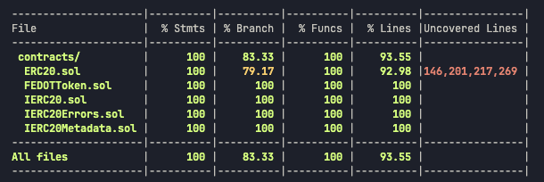
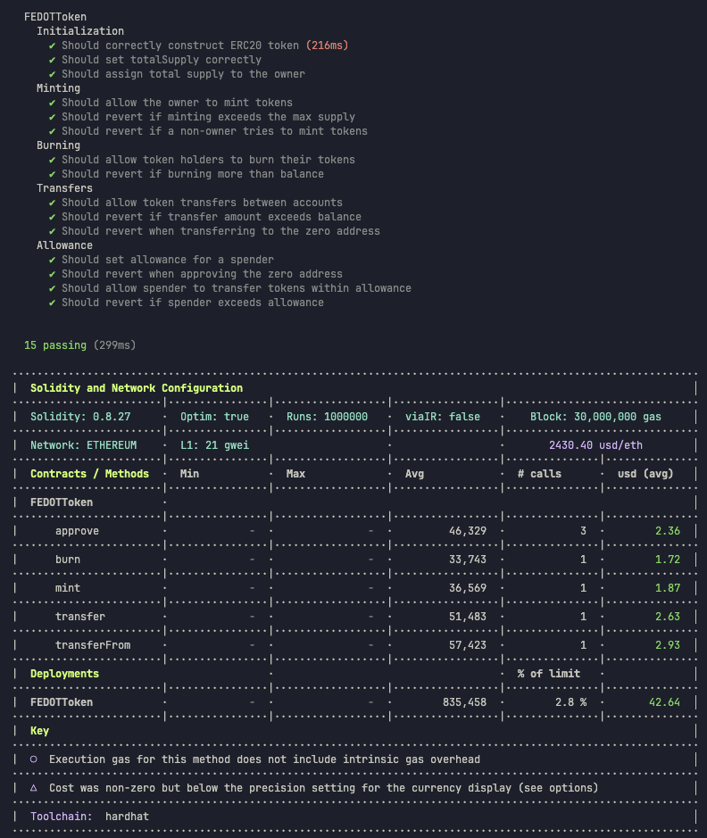

# Проект MyERC20 Token

## Используемые технологии

- **Hardhat** — инструмент для разработки, тестирования и деплоя смарт-контрактов.
- **@nomicfoundation/hardhat-toolbox-viem** — набор инструментов для интеграции Viem и работы с Ethereum через Hardhat.
- **dotenv** — для управления переменными окружения.
- **eslint** — для анализа кода и поддержания единого стиля кодирования.
- **prettier** — для автоматического форматирования кода.
- **husky** — для запуска Git хуков.
- **lint-staged** — для проверки только тех файлов, которые изменились при коммите.

Этот проект демонстрирует реализацию контракта стандарта ERC20 на основе Hardhat с использованием Viem. В проекте реализован контракт **FEDOTToken**, включающий такие возможности, как выпуск токенов (mint), сжигание токенов (burn), управление правами на использование токенов другими пользователями (allowance), а также полное покрытие тестами.

## Установка зависимостей

Перед началом работы выполните установку всех необходимых зависимостей:

```shell
npm ci
```

## Переменные окружения

Для работы с проектом вам потребуется настроить следующие переменные окружения. Они должны быть добавлены в файл `.env` в корневой папке проекта:

```bash
INFURA_ID=
INFURA_SEPOLIA_URL=
INFURA_MAINNET_URL=
INFURA_BASE_URL=
PRIVATE_KEY=
TESTNET_MNEMONIC=
ETHERSCAN_API_KEY=
COINMARKETCAP_API_KEY=
```

## Запуск задач проекта

Для выполнения тестов и работы с проектом доступны следующие команды:

- Запуск всех тестов:
  ```shell
  npx hardhat test
  ```
- Запуск тестов с отчетом по использованию газа:
  ```shell
  REPORT_GAS=true npx hardhat test
  ```
- Запуск локальной сети для разработки:
  ```shell
  npx hardhat node
  ```

## Деплой контрактов

### Деплой контракта на локальную сеть

Запускаем Hardhat Network
```bash
npx hardhat node
```

Запустите локальную сеть, а затем выполните деплой контракта:

```bash
npx hardhat ignition deploy ignition/modules/FEDOTToken.ts --network localhost
```

### Деплой контракта на Sepolia

Для деплоя контракта на сеть Sepolia выполните команду:

```bash
npx hardhat ignition deploy ignition/modules/FEDOTToken.ts --network sepolia
```

### Верификация контракта на Etherscan

После деплоя контракта на Sepolia, вы можете выполнить его верификацию на Etherscan:

```bash
npx hardhat verify --network sepolia <contract-address> "1893456000"
```

Где `<contract-address>` — это адрес вашего контракта.

## Линтинг и форматирование

Для поддержания качества кода и единого стиля в проекте используются следующие команды:

- Автоматическое исправление ошибок линтинга (ESLint):
  ```shell
  npm run lint:fix
  ```

- Форматирование кода (Prettier):
  ```shell
  npm run format
  ```

## Запуск тестов и проверка покрытия

Вы можете запустить тесты с анализом покрытия следующим образом:

```bash
SOLIDITY_COVERAGE=true npx hardhat coverage
```

Отчет покажет информацию по покрытиям, такие как:
- % Stmts — количество покрытых выражений
- % Branch — покрытие ветвлений (if/else)
- % Funcs — покрытие функций
- % Lines — количество покрытых строк кода

<p align="left">
 
</p>


## Покрытие контрактов тестами

Контракты полностью покрыты тестами для следующих сценариев:
- **Инициализация токена**
- **Выпуск токенов (mint)**
- **Сжигание токенов (burn)**
- **Переводы токенов между аккаунтами**
- **Разрешения на использование токенов (allowance)**

<p align="left">
 
</p>
